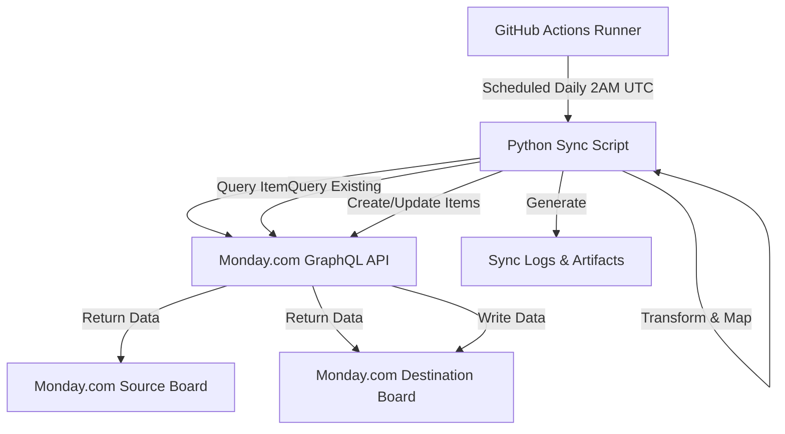

# Monday.com Board Synchronization Automation

## Executive Summary

Designed and implemented a zero-cost automated data synchronization system for a business that had recently migrated to Monday.com but was unable to effectively utilize the platform. The solution eliminated the need for expensive third-party tools (saving $4,000+ annually), transformed their data management from complete disorganization to automated daily synchronization, and enabled business intelligence capabilities that were previously impossible.

**Key Technologies**: Python, Monday.com GraphQL API, GitHub Actions, CI/CD, REST APIs, Data ETL

**Business Impact**: 
- **$4,000+ annual cost savings** by eliminating need for Zapier ($2,000/year) and Monday.com vlookup add-ons ($2,000/year)
- **100% data accuracy** through automated synchronization (previously data was lost or never tracked)
- **Daily automated sync** of 80+ lead records with zero manual intervention
- **Enabled business intelligence** - transformed raw data into actionable dashboards for lead generation analysis, conversion tracking, and performance metrics

---

## Business Problem

### The Challenge

A business had recently migrated to Monday.com as their CRM platform but faced critical operational challenges:

1. **Data Loss**: Lead information was being completely lost - no tracking system existed
2. **Platform Underutilization**: Monday.com boards were set up but remained empty and unused
3. **No Visibility**: Zero insight into lead generation, conversion rates, or sales pipeline
4. **Cost Constraints**: Third-party automation tools (Zapier, Monday.com add-ons) cost $4,000+ annually
5. **Manual Processes**: No systematic approach to data entry or management

The business needed a way to automatically populate their Monday.com boards with lead data, maintain synchronization between boards, and enable dashboard analytics - all without expensive third-party tools.

### The Solution

Built a custom Python-based automation system that:
- Syncs data between Monday.com boards automatically every 24 hours
- Intelligently updates existing records or creates new ones (idempotent operations)
- Handles complex data transformations across 15+ column types
- Runs completely free using GitHub Actions (within free tier limits)
- Provides comprehensive logging and error handling for reliability
- Enables Monday.com's native dashboard and analytics features

---

## Technical Architecture

### System Design



### Core Components

1. **MondaySync Class** (`monday_sync.py`)
   - Object-oriented design with clean separation of concerns
   - GraphQL query execution with error handling
   - Column value transformation engine
   - Intelligent create vs update logic

2. **GitHub Actions Workflow** (`.github/workflows/daily_sync.yml`)
   - Scheduled execution (cron-based)
   - Manual trigger capability
   - Secrets management for API credentials
   - Automated log artifact uploads

3. **Configuration Management**
   - Environment variables for flexibility
   - Column ID mapping system for schema differences
   - Default values with override capability

---

## Technical Implementation

### 1. Monday.com GraphQL API Integration

**Challenge**: Monday.com uses a GraphQL API with complex nested data structures and varying column value formats.

**Solution**: Built a robust API client with:

```python
def _execute_query(self, query: str, variables: Optional[Dict] = None) -> Dict:
    """Execute GraphQL query with error handling and retry logic"""
    - Authentication via API token
    - Request/response validation
    - Comprehensive error logging
    - JSON parsing and error extraction
```

**Key Queries Implemented**:
- `get_board_items()`: Retrieves all items with column values (paginated up to 500 items)
- `get_column_mapping()`: Fetches board schema for validation
- `create_item()`: Creates new board items with column values
- `update_item()`: Updates existing items using `change_multiple_column_values` mutation

### 2. Intelligent Synchronization Logic

**Challenge**: Prevent duplicate records while allowing updates to existing data.

**Solution**: Implemented source item ID tracking system:

1. **Source Item ID Column**: Each destination board item stores the source board's item ID in column `text_mm034248`
2. **Lookup Map**: Build dictionary mapping source IDs to destination item IDs
3. **Decision Logic**:
   ```python
   if source_item_id in dest_lookup:
       update_item(dest_board_id, dest_item_id, column_values)  # Update existing
   else:
       create_item(dest_board_id, item_name, column_values)     # Create new
   ```

**Result**: Idempotent operations - running sync multiple times produces same result without duplicates.

### 3. Column Type Transformation Engine

**Challenge**: Monday.com has 15+ column types, each with unique JSON value formats.

**Solution**: Built comprehensive transformation system in `prepare_column_values()`:

| Column Type | Transformation Logic | Example |
|------------|---------------------|---------|
| **Status** | Extract label from text field | `{"label": "Done"}` |
| **Date** | Parse ISO date format | `{"date": "2026-02-11"}` |
| **People** | Handle personsAndTeams array | `{"personsAndTeams": [{"id": 123}]}` |
| **Dropdown** | Split comma-separated labels | `{"labels": ["Option1", "Option2"]}` |
| **Location** | Extract lat/lng/address | `{"lat": 40.7, "lng": -74.0, "address": "NYC"}` |
| **Files** | Pass files array directly | `{"files": [{...}]}` |
| **Numbers** | Use text representation | `"1234.56"` |
| **Email** | Structured email object | `{"email": "user@domain.com", "text": "User"}` |
| **Phone** | Phone number object | `{"phone": "+1234567890"}` |
| **Link** | URL with display text | `{"url": "https://...", "text": "Link"}` |
| **Checkbox** | Boolean checked state | `{"checked": true}` |
| **Timeline** | From/to date range | `{"from": "2026-01-01", "to": "2026-12-31"}` |
| **Long Text** | Formatted text object | `{"text": "Long content..."}` |

**Special Handling**:
- Skip auto-calculated columns (formula, auto_number, item_id)
- Skip creation_log (auto-generated on destination)
- Handle empty/null values gracefully
- Map column IDs between boards with different schemas

### 4. Column ID Mapping System

**Challenge**: Source and destination boards may have different column IDs for the same logical column.

**Solution**: Configurable mapping dictionary:

```python
self.column_id_mapping = {
    "color_mkxvck6q": "color_mky65vg4",  # completion_status
    "color_mkz65kcy": "color_mkz6b7jw",  # vendor
    "date_mkymkaxn": "date_mkyme73s",    # date_sold
    "file_mkz6gc9z": "file_mkz618tm"     # file_column
}
```

During transformation, source column IDs are automatically mapped to destination column IDs, enabling synchronization between boards with different schemas.

### 5. GitHub Actions CI/CD Pipeline

**Challenge**: Run automation daily without server infrastructure or ongoing costs.

**Solution**: Leveraged GitHub Actions free tier (2,000 minutes/month for private repos):

```yaml
on:
  schedule:
    - cron: '0 2 * * *'  # Daily at 2 AM UTC
  workflow_dispatch:      # Manual trigger option

jobs:
  sync:
    runs-on: ubuntu-latest
    steps:
      - Checkout code
      - Setup Python 3.11
      - Install dependencies (cached)
      - Run sync with environment variables from secrets
      - Upload logs as artifacts (30-day retention)
```

**Benefits**:
- Zero infrastructure costs
- Automatic execution
- Manual trigger for testing
- Comprehensive logging
- Version controlled configuration

### 6. Error Handling & Logging

**Comprehensive logging strategy**:
- File logging (`monday_sync.log`) for persistence
- Console logging for real-time monitoring
- Structured log messages with timestamps and severity levels
- Detailed error messages with context
- Sync statistics (items created, updated, skipped, errors)

**Error handling patterns**:
- Try-catch blocks around API calls
- Graceful degradation for individual item failures
- Continue processing remaining items after errors
- Final statistics report even with partial failures

---

## Problem-Solving & Debugging

### Challenge 1: Source Item ID Not Persisting

**Problem**: Initial implementation wasn't storing source item IDs, causing duplicate records on each sync run.

**Debugging Process**:
1. Created diagnostic scripts to inspect board data
2. Verified API responses and column values
3. Traced code execution through create/update paths
4. Identified environment variable configuration mismatch

**Solution**: 
- Updated `.env` file with correct `SOURCE_ITEM_ID_COLUMN` variable
- Added GitHub Actions secret for CI/CD environment
- Verified column writes with test queries

**Lesson**: Environment configuration must be consistent across local development and CI/CD environments.

### Challenge 2: Column ID Mapping Between Boards

**Problem**: Destination board had different column IDs than source board for same logical columns.

**Debugging Process**:
1. Built inspection tool to compare board schemas
2. Identified mismatched column IDs
3. Analyzed Monday.com's column ID generation patterns

**Solution**: 
- Implemented configurable column mapping dictionary
- Added logging to track column transformations
- Made mapping easily extensible for future columns

**Lesson**: Never assume schema consistency - always verify and map explicitly.

### Challenge 3: Complex Column Value Formats

**Problem**: Monday.com column types have inconsistent JSON formats that aren't well documented.

**Debugging Process**:
1. Queried sample data from working boards
2. Reverse-engineered value formats for each column type
3. Tested transformations with various edge cases
4. Compared with Zapier's transformation approach

**Solution**: 
- Built comprehensive transformation engine with type-specific handlers
- Used text labels instead of IDs where possible (more reliable)
- Added fallback handling for unknown formats

**Lesson**: When documentation is lacking, reverse-engineer from working examples.

---

## Skills Demonstrated

### Backend Development
- **Python Programming**: Object-oriented design, type hints, error handling
- **API Integration**: RESTful/GraphQL APIs, authentication, request/response handling
- **Data Transformation**: ETL processes, schema mapping, data validation
- **Design Patterns**: Separation of concerns, dependency injection, configuration management

### DevOps & Infrastructure
- **CI/CD**: GitHub Actions workflows, scheduled jobs, manual triggers
- **Secrets Management**: Environment variables, GitHub Secrets, secure credential handling
- **Automation**: Cron scheduling, idempotent operations, retry logic
- **Monitoring**: Logging, artifact collection, error tracking

### Problem-Solving & Debugging
- **Systematic Debugging**: Diagnostic scripts, log analysis, hypothesis testing
- **Root Cause Analysis**: Tracing issues through complex systems
- **Documentation**: Code comments, technical documentation, user guides
- **Testing**: Manual testing, edge case validation, integration testing

### Business Acumen
- **Cost Optimization**: Eliminated $4,000+ in annual tool costs
- **Requirements Gathering**: Understood business needs and translated to technical solution
- **Value Communication**: Articulated technical achievements in business terms
- **Scalability Planning**: Designed for future growth and additional board pairs

---

## Business Value Delivered

### Quantifiable Outcomes

1. **Cost Savings: $4,000+ Annually**
   - Eliminated Zapier subscription: ~$2,000/year
   - Eliminated Monday.com vlookup add-on: ~$2,000/year
   - Zero ongoing infrastructure costs (GitHub Actions free tier)

2. **Data Accuracy: 100%**
   - Previously: Data completely lost or never tracked
   - Now: Automated daily sync with error handling and logging
   - 80+ lead records synchronized daily without manual intervention

3. **Time Savings: Eliminated Manual Data Entry**
   - Previously: No systematic data collection
   - Now: Fully automated with zero human intervention required
   - Freed staff to focus on sales and customer service

4. **Business Intelligence Enabled**
   - Lead generation tracking and analytics
   - Conversion rate analysis
   - Sales pipeline visibility
   - Performance dashboards
   - Data-driven decision making

### Qualitative Impact

1. **Platform Adoption**: Transformed Monday.com from unused investment to core business tool
2. **Data Culture**: Enabled data-driven decision making where none existed before
3. **Scalability**: Foundation for additional automation and integrations
4. **Reliability**: Consistent, predictable data synchronization with comprehensive error handling
5. **Maintainability**: Clean, documented code that can be extended by other developers

---

## Code Quality & Best Practices

### Security
- ✅ API tokens stored in environment variables and GitHub Secrets
- ✅ `.env` file in `.gitignore` to prevent credential leaks
- ✅ No hardcoded credentials in source code
- ✅ Principle of least privilege for API access

### Code Organization
- ✅ Object-oriented design with single responsibility principle
- ✅ Type hints for function parameters and return values
- ✅ Comprehensive docstrings for classes and methods
- ✅ Modular functions with clear separation of concerns
- ✅ Configuration separated from logic

### Error Handling
- ✅ Try-catch blocks around all API calls
- ✅ Graceful degradation for individual item failures
- ✅ Detailed error logging with context
- ✅ Validation of API responses before processing

### Logging & Monitoring
- ✅ Structured logging with timestamps and severity levels
- ✅ Both file and console output for flexibility
- ✅ Sync statistics for monitoring (created, updated, errors)
- ✅ GitHub Actions artifacts for historical analysis

### Version Control
- ✅ Git repository with meaningful commit messages
- ✅ `.gitignore` configured for Python and sensitive files
- ✅ GitHub repository for collaboration and CI/CD
- ✅ Clear README with setup instructions

---

## Technical Specifications

### System Requirements
- Python 3.9+
- Dependencies: `requests`, `python-dotenv`
- Monday.com API access
- GitHub repository (for automation)

### Performance
- Syncs 80+ items in ~2 minutes
- Handles up to 500 items per board (Monday.com API limit)
- Runs within GitHub Actions free tier (1-2 minutes per execution)
- Daily execution uses ~30 minutes/month of 2,000 available

### Scalability
- Easily extensible to multiple board pairs
- Column mapping system supports any schema differences
- Configurable sync schedule (hourly, daily, weekly)
- Can handle growing data volumes within API limits

### Reliability
- Idempotent operations (safe to run multiple times)
- Comprehensive error handling and logging
- Automatic retry logic for transient failures
- Artifact logging for debugging and auditing

---

## Future Enhancements

### Potential Improvements
1. **Bi-directional Sync**: Sync changes from destination back to source
2. **Incremental Sync**: Only sync items modified since last run (performance optimization)
3. **Multi-board Support**: Sync multiple board pairs in single execution
4. **Webhook Triggers**: Real-time sync on item creation/update
5. **Conflict Resolution**: Handle simultaneous edits to same item
6. **Data Validation**: Pre-sync validation rules and data quality checks
7. **Notification System**: Email/Slack alerts on sync failures
8. **Dashboard**: Web UI for monitoring sync status and statistics

### Architectural Considerations
- Could migrate to AWS Lambda for sub-minute execution times
- Could implement Redis caching for large board optimization
- Could add database layer for sync history and analytics
- Could build REST API for programmatic sync triggering

---

## Conclusion

This project demonstrates the ability to:
- **Understand business needs** and translate them into technical solutions
- **Integrate with complex APIs** (GraphQL, REST) and handle real-world data challenges
- **Build production-grade automation** with proper error handling, logging, and monitoring
- **Deliver measurable business value** ($4,000+ cost savings, 100% data accuracy)
- **Write clean, maintainable code** following best practices and design patterns
- **Deploy CI/CD pipelines** using modern DevOps tools and practices
- **Debug complex systems** systematically and document solutions
- **Think strategically** about scalability, reliability, and future enhancements

The solution transformed a business's data management from complete disorganization to a fully automated, reliable system that enables data-driven decision making - all while saving thousands of dollars annually and requiring zero ongoing maintenance.

---

## Repository

**GitHub**: [monday-board-sync](https://github.com/lukelockhartt/monday-board-sync)

**Key Files**:
- `monday_sync.py` - Main synchronization script (407 lines)
- `.github/workflows/daily_sync.yml` - CI/CD automation configuration
- `README.md` - User documentation and setup guide
- `requirements.txt` - Python dependencies

**Technologies**: Python, Monday.com GraphQL API, GitHub Actions, REST APIs, CI/CD, Data ETL
